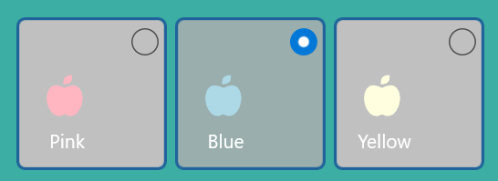
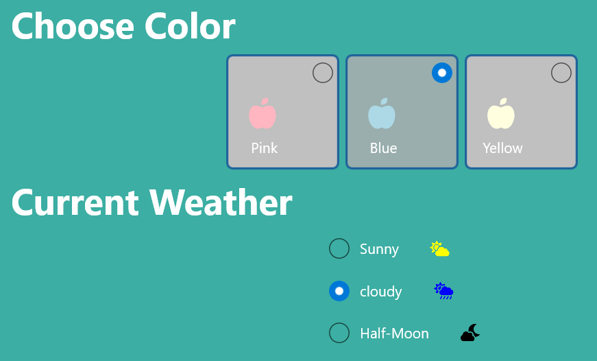

# How-to-Create-Beautiful-Custom-RadioButton-with-Xamarin.Forms?

The Xamarin.Forms RadioButton was fully customizable and templatable. This section explains how to add image or other view with radio button and make it look beautiful!


 
GroupKey: The `GroupKey` in `SfRadioButton` allows you to group a set of radio buttons that are present inside any layout. By grouping in this way, you can only select one radio button from the same GroupKey at a time.

## Steps to enhance radio button:
Extend SfButton and add required fields. 

```C#
public partial class RadioButtonControl : SfButton
{
. . . 
. . . 
    /// <summary>
    /// Gets or sets the group key for <see cref="RadioButtonControl"/>. This is a Bindable property.
    /// </summary>
    public static readonly BindableProperty GroupKeyProperty = BindableProperty.Create(
     "GroupKey", typeof(ButtonGroupKey), typeof(RadioButtonControl), null, BindingMode.Default, null, GroupKeyPropertyChanged);

    /// <summary>
    /// Gets or sets the group key for <see cref="RadioButtonControl"/>.
    /// </summary>
    public ButtonGroupKey GroupKey
    {
        get { return (ButtonGroupKey)GetValue(GroupKeyProperty); }
        set { this.SetValue(GroupKeyProperty, value); }
    }
. . .
// Check sample link for more.
. . . 
}
```

## Steps to use customizable radio button 

Step 1: Extend SfButton as discussed above or find it form sample. 

Step 2: Add resource for GroupKey and initiate the control with required template.

```xml
. . .
<ContentPage.Resources>
        <local:ButtonGroupKey x:Key="buttonGroupKey" />
</ContentPage.Resources>
. . . 
<control:RadioButtonControl BackgroundColor="Silver" GroupKey="{StaticResource buttonGroupKey}” HorizontalOptions="Start">

<control:RadioButtonControl.ItemTemplate>
    <DataTemplate>
                <StackLayout WidthRequest="70" HeightRequest="70">
                  . . .
                </StackLayout>
            </DataTemplate>
</control:RadioButtonControl.ItemTemplate>
```

Step 3: Set the RadioPosition if required. 

```xml
<control:RadioButtonControl RadioPosition="RightTop"                                               HorizontalOptions="Start">
. . .
</control:RadioButtonControl.ItemTemplate>
```

